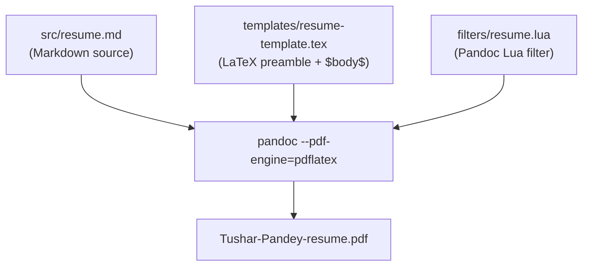
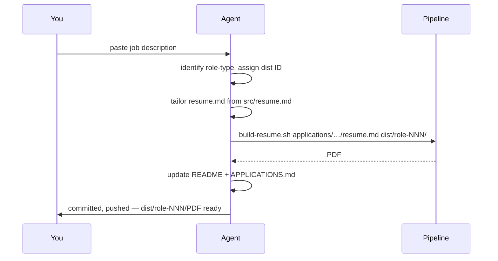
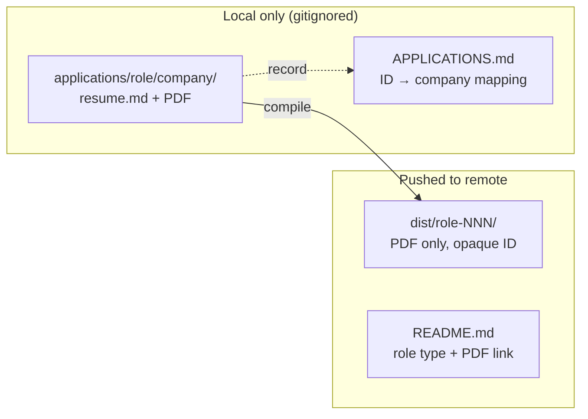

# Resume Pipeline

A Markdown-to-PDF resume system with AI-assisted tailoring for job applications.

---

## Resumes

| ID | Role Type | PDF |
|----|-----------|-----|
| base | General | [PDF Link](base/Tushar-Pandey-resume.pdf) |
| distributed-backend-001 | Distributed Backend / Infra | [PDF Link](dist/distributed-backend-001/Tushar-Pandey-resume.pdf) |
| fullstack-001 | Fullstack / Product Eng | [PDF Link](dist/fullstack-001/Tushar-Pandey-resume.pdf) |
| distributed-backend-002 | Distributed Backend / Infra | [PDF Link](dist/distributed-backend-002/Tushar-Pandey-resume.pdf) |

---

## Why this exists

Tailoring a resume for every application by hand is slow, error-prone, and produces drift across versions. LaTeX gives great output but is hostile to quick edits. This repo solves both problems: Markdown as the single editable source, Pandoc + a Lua filter to render it into a pixel-perfect PDF, and an AI agent that tailors the whole thing to a job description in one shot.


The agent reorders bullets, rewrites the summary, and adjusts the skills section — without fabricating anything not already in the base resume. Company names never appear in the published output.

---

## How it works

### Pipeline



**`src/resume.md`** — the only file you edit day-to-day. Plain Markdown with structural conventions the Lua filter understands.

**`filters/resume.lua`** — translates the Markdown AST into custom LaTeX resume commands:

| Markdown pattern | LaTeX output |
|-----------------|-------------|
| H1 + contact paragraph | `\begin{center}` heading block |
| H2 | `\section{}` |
| H3 + italic subline | `\resumeSubheading{company}{date}{role}{location}` |
| H3 `**bold** \| _italic_` | `\resumeProjectHeading{\textbf{…} $\|$ \emph{…}}{}` |
| Bullet list | `\resumeItemListStart` / `\resumeItem{}` / `\resumeItemListEnd` |

**`templates/resume-template.tex`** — full LaTeX preamble (packages, margins, custom commands). Body is `$body$`.

**`config/build.conf`** — pipeline configuration, including the output PDF filename:
```bash
OUTPUT_FILENAME="Tushar-Pandey-resume.pdf"
```

### Markdown conventions

```markdown
# Full Name
phone | email | [linkedin](url) | [github](url)

## Experience

### Role Title | Company Name | Date Range
_Team description | City, Country_

- **Achievement**: what you built and why it mattered.

## Key Projects

### **Project Name** | _Tech Stack_

- What it does.

## Technical Skills

- **Category**: item, item, item
```

The only non-obvious rule: the **last** ` | ` in an H3 line is the date separator, so company names containing ` | ` work without escaping.

### Building

```bash
# Prerequisites
brew install pandoc
# BasicTeX: https://tug.org/mactex/morepackages.html

# Build base resume
./scripts/build-resume.sh

# Build a tailored variant
./scripts/build-resume.sh \
  applications/<role-type>/<company-slug>/resume.md \
  dist/<role-type>-<NNN>/
```

Output filename is set in `config/build.conf`. Default: `Tushar-Pandey-resume.pdf`.

---

## AI-assisted tailoring



The agent:
- Rewrites the profile summary to speak to the role
- Reorders bullets within each job to front-load what the JD values
- Leads the skills section with the role's key technologies
- Pulls extra detail from `base/Tushar-Pandey-resume.md` when the base `src/` is lighter

**Hard constraint:** no fabrication. Every metric, technology, and bullet in the output must exist in the base resume.

### Privacy model



Company names exist only on your machine — in `applications/` directory paths and `APPLICATIONS.md`. What gets pushed is a PDF behind an opaque role-type ID.

---

## Repo structure

```
├── src/resume.md                  # Pandoc Markdown source (edit this)
├── base/                          # Full content library + original LaTeX (do not modify)
├── templates/resume-template.tex  # Pandoc LaTeX template
├── filters/resume.lua             # Lua filter (AST → custom LaTeX commands)
├── config/build.conf              # Pipeline config (output filename, etc.)
├── scripts/build-resume.sh        # Build script
├── dist/                          # Tracked — published PDFs, opaque IDs
│   └── <role-type>-<NNN>/
│       └── <OUTPUT_FILENAME>
├── applications/                  # Gitignored — tailored sources, company slugs
│   └── <role-type>/<company-slug>/
├── .raven/                        # Agent workflow artifacts
└── compile.sh                     # Legacy pdflatex script (still functional)
```

---

## See also

- [AGENTS.md](AGENTS.md) — agent instructions: tailoring workflow, directory model, Markdown conventions
- [CONTRIBUTING.md](CONTRIBUTING.md) — human guide: editing, building, index format
